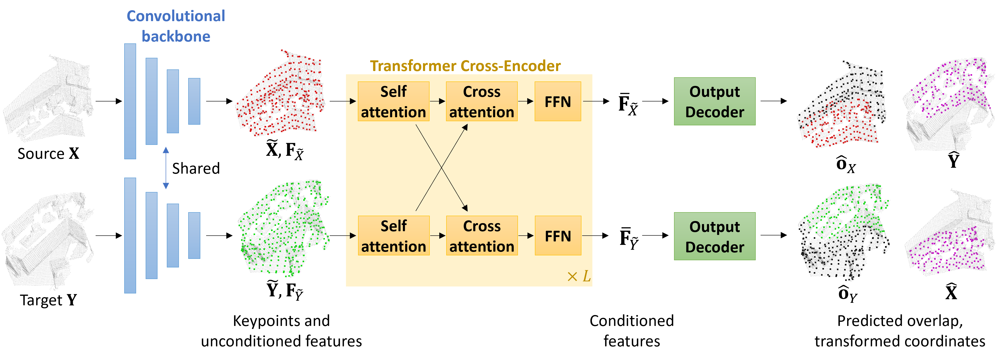

# REGTR: End-to-end Point Cloud Correspondences with Transformers

This repository contains the source code for REGTR. REGTR utilizes multiple transformer attention layers to directly predict each downsampled point's corresponding location in the other point cloud. Unlike typical correspondence-based registration algorithms, the predicted correspondences are clean and do not require an additional RANSAC step. This results in a fast, yet accurate registration.



If you find this useful, please cite:
```
@inproceedings{yew2022regtr,
  title={REGTR: End-to-end Point Cloud Correspondences with Transformers},
  author={Yew, Zi Jian and Lee, Gim hee},
  booktitle={CVPR},
  year={2022},
}
```


## Dataset environment

Our model is trained with the following environment:

* Python 3.8.8
* PyTorch 1.9.1 with torchvision 0.10.1 (Cuda 11.1)
* [PyTorch3D](https://github.com/facebookresearch/pytorch3d) 0.6.0
* [MinkowskiEngine](https://github.com/NVIDIA/MinkowskiEngine) 0.5.4

Other required packages can be installed using pip:  `pip install -r src/requirements.txt`.


## Data and Preparation

Follow the following instructions to download each dataset (as necessary). Your folder should then look like this:

```
.
├── data/
    ├── indoor/
        ├── test/
        |   ├── 7-scenes-redkitchen/
        |   |   ├── cloud_bin_0.info.txt
        |   |   ├── cloud_bin_0.pth
        |   |   ├── ...
        |   ├── ...
        ├── train/
        |   ├── 7-scenes-chess/
        |   |   ├── cloud_bin_0.info.txt
        |   |   ├── cloud_bin_0.pth
        |   |   ├── ...
        ├── test_3DLoMatch_pairs-overlapmask.h5
        ├── test_3DMatch_pairs-overlapmask.h5
        ├── train_pairs-overlapmask.h5
        └── val_pairs-overlapmask.h5
    └── modelnet40_ply_hdf5_2048
        ├── ply_data_test0.h5
        ├── ply_data_test1.h5
        ├── ...
├── src/
└── Readme.md
```

### 3DMatch

Download the processed dataset from [Predator project site](https://github.com/overlappredator/OverlapPredator), and place them into `../data`. 

Then for efficiency, it is recommended to pre-compute the overlapping points (used for computing the overlap loss). You can do this by running the following from the `src/` directory:

```bash
python data_processing/compute_overlap_3dmatch.py
```

### ModelNet

Download the [PointNet](https://github.com/charlesq34/pointnet)-processed dataset from [here](https://shapenet.cs.stanford.edu/media/modelnet40_ply_hdf5_2048.zip), and place it into `../data`.


## Pretrained models

You can download our trained models [here](https://github.com/yewzijian/RegTR/releases/download/v1/trained_models.zip). Unzip the files into the `trained_models/`.


## Demo

We provide a simple demo script `demo.py` that loads our model and checkpoints, registers 2 point clouds, and visualizes the result. Simply download the pretrained models and run the following from the `src/` directory:

```bash
python demo.py --example 0  # choose from 0 - 6 (see code for details)
```

Press 'q' to end the visualization and exit. Refer the documentation for `visualize_result()` for explanation of the visualization.


## Inference/Evaluation

The following code in the `src/` directory performs evaluation using the pretrained checkpoints as provided above; change the checkpoint paths accordingly if you're using your own trained models. Note that due to non-determinism from the neighborhood computation during our GPU-based KPConv processing, the results will differ slightly (e.g. mean registration recall may differ by around +/- 0.2%) between each run.

### 3DMatch / 3DLoMatch

This will run inference and compute the evaluation metrics used in Predator (registration success of <20cm).

```bash
# 3DMatch
python test.py --dev --resume ../trained_models/3dmatch/ckpt/model-best.pth --benchmark 3DMatch

# 3DLoMatch
python test.py --dev --resume ../trained_models/3dmatch/ckpt/model-best.pth --benchmark 3DLoMatch
```

### ModelNet

```bash
# ModelNet
python test.py --dev --resume ../trained_models/modelnet/ckpt/model-best.pth --benchmark ModelNet

# ModelLoNet
python test.py --dev --resume ../trained_models/modelnet/ckpt/model-best.pth --benchmark ModelNet
```


## Training

Run the following commands from the `src/` directory to train the network. 

### 3DMatch (Takes ~2.5 days on a Titan RTX)

```bash
python train.py --config conf/3dmatch.yaml
```

### ModelNet (Takes <2 days on a Titan RTX)

```bash
python train.py --config conf/modelnet.yaml
```


## Acknowledgements

We would like to thank the authors for [Predator](https://github.com/overlappredator/OverlapPredator), [D3Feat](https://github.com/XuyangBai/D3Feat.pytorch), [KPConv](https://github.com/HuguesTHOMAS/KPConv-PyTorch), [DETR](https://github.com/facebookresearch/detr) for making their source codes public.